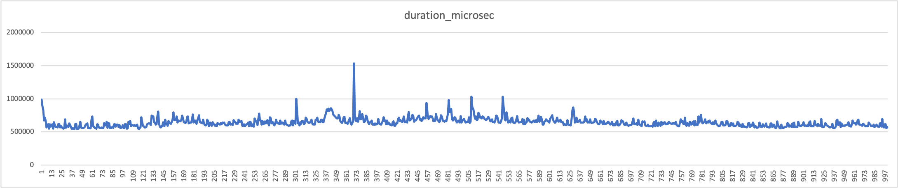

# 4124-xmlperformance-testdata

This repository contains test data for measuring the performance of the xmlupload. 


## Description of the test data

The folder `bistreams` contains test files in the formats

 - docx
 - jpeg
 - mp3
 - mp4
 - txt
 - zip

For each of these formats, there is a file of the (approximate) size

 - 0.1 MB
 - 1 MB
 - 10 MB
 - 100 MB

There are different XML data files that follow different testing strategies:

 - `all_files.xml` contains every bitstream once (24 bitstreams --> 24 resources).
 - `no_files_x_links_x_textfields.xml` contains 1000 resources of type `Resource`, each having x resptr-links and x text fields (where 0 <= x < 5).
 - `one_file.xml` contains 1000 identical `StillImageRepresentation`s that all contain the same 1 MB JPEG image.


## Steps to measure performance 

First, create the project `xmlperformance` with 

```
dsp-tools create xmlperformance.json
```

Then, check out the branch `wip/dev-1512-introduce-metrics` of dsp-tools and upload the data files with

```
dsp-tools xmlupload --metrics xml_files/all_files.xml
dsp-tools xmlupload --metrics xml_files/no_files_0_links_0_textfields.xml
dsp-tools xmlupload --metrics xml_files/no_files_1_links_1_textfields.xml
dsp-tools xmlupload --metrics xml_files/no_files_2_links_2_textfields.xml
dsp-tools xmlupload --metrics xml_files/no_files_3_links_3_textfields.xml
dsp-tools xmlupload --metrics xml_files/no_files_4_links_4_textfields.xml
dsp-tools xmlupload --metrics xml_files/one_file.xml
```

dsp-tools will then create a metrics report in the folder `metrics`.


## Observations

There are two main network events: uploading the file to SIPI, and then creating the resource in the API. 


### 1. SIPI call

The SIPI call duration increases with file size, over all file types. The average speeds **on localhost** are:

- 0.1 - 0.2 s for the 100 KB files
- 0.6 - 0.7 s for the 1 MB files
- 5.5 - 7.0 s for the 10 MB files
- 60  - 70  s for the 100 MB files

While there is some variance in the data, the performance remains stable over time. This can be seen in these two 
diagrams, where the same 1 MB image file was uploaded 1000 times in row:  
  
  

**These times are not acceptable for localhost, but I don't know how to investigate this further.** I only have one 
observation: dsp-tools opens the file and sends it as stream to SIPI, instead of sending it directly, see 
[this line of code](https://github.com/dasch-swiss/dsp-tools/blob/main/knora/dsplib/models/sipi.py#L42).


### 2. API call

**On localhost**, the API call takes, on average, 0.2 seconds over all file types and all file sizes, with one major 
exception: Creating an MP4 file takes more time, the bigger the file is:

- 0.6 - 0.8 s for an MP4 file of 100 KB
- 1.8 - 1.9 s for an MP4 file of 1 MB
- 2.3 - 2.4 s for an MP4 file of 10 MB
- 11  - 14  s for an MP4 file of 100 MB

**There is clearly something wrong with the creation of MP4 files in the API.**
